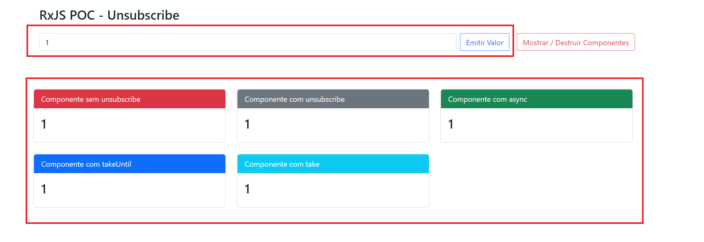
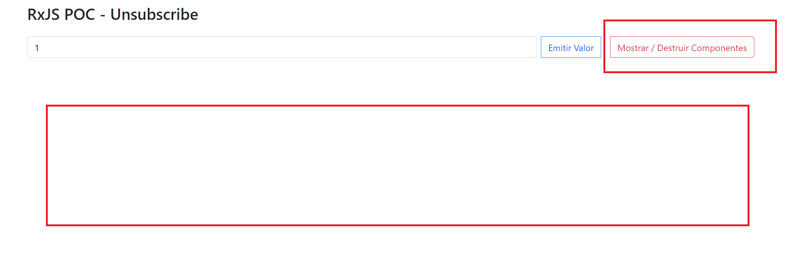
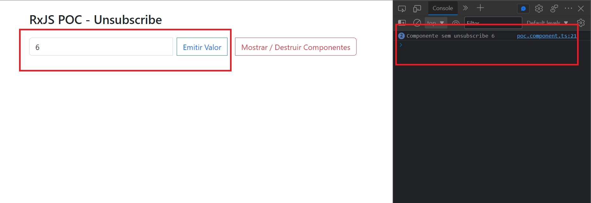

# ANGULAR UNSUBSCRIBE

## Front-End

- Angular
- Boostrap
- Rxjs

#

### POC abordando conceito unsubscribe do observable.

#

- Emitindo um valor via imput que é consumido pelos componentes através do serviço.

- Os componentes são destruídos, porém um componente sem a funcionalidade de se desinscrever continua lendo informações.

- Componente sem unsubscribe recebendo informação mesmo depois de destruído (sem apresentar na tela).

